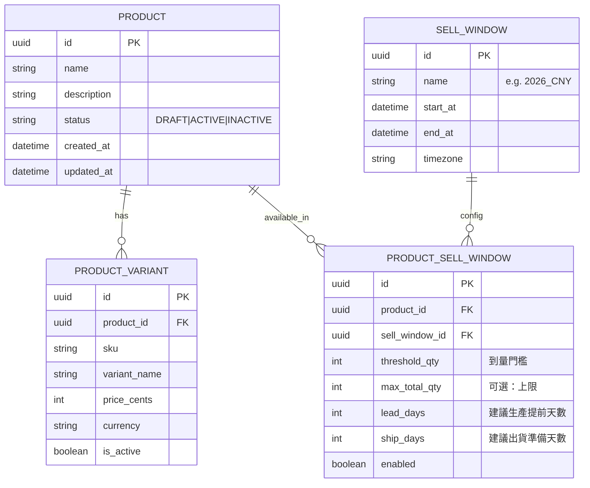
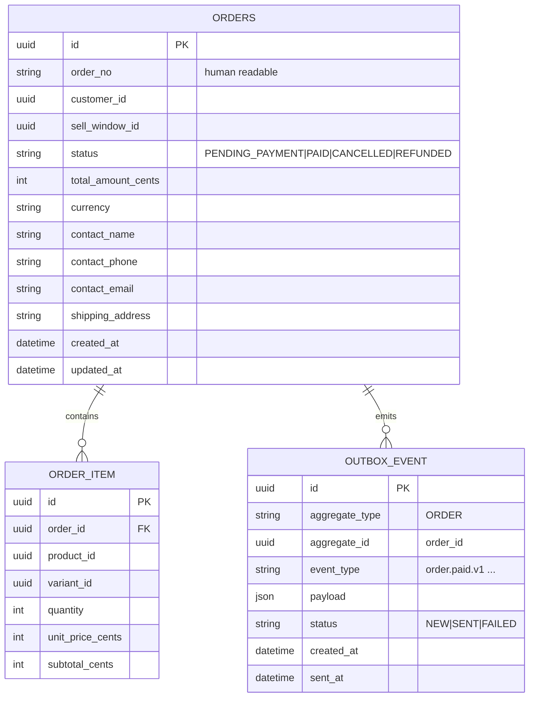
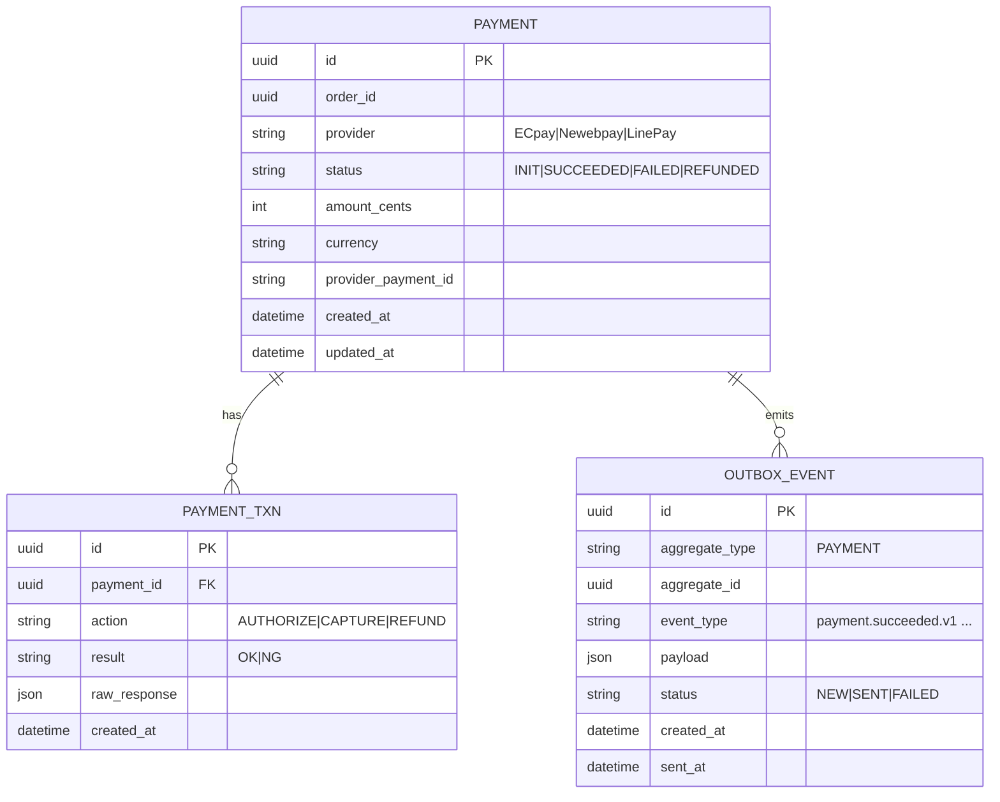
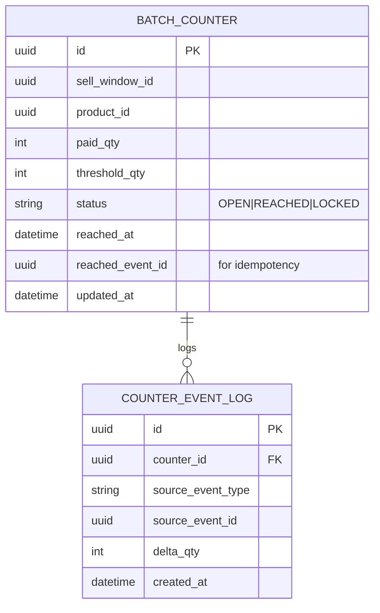
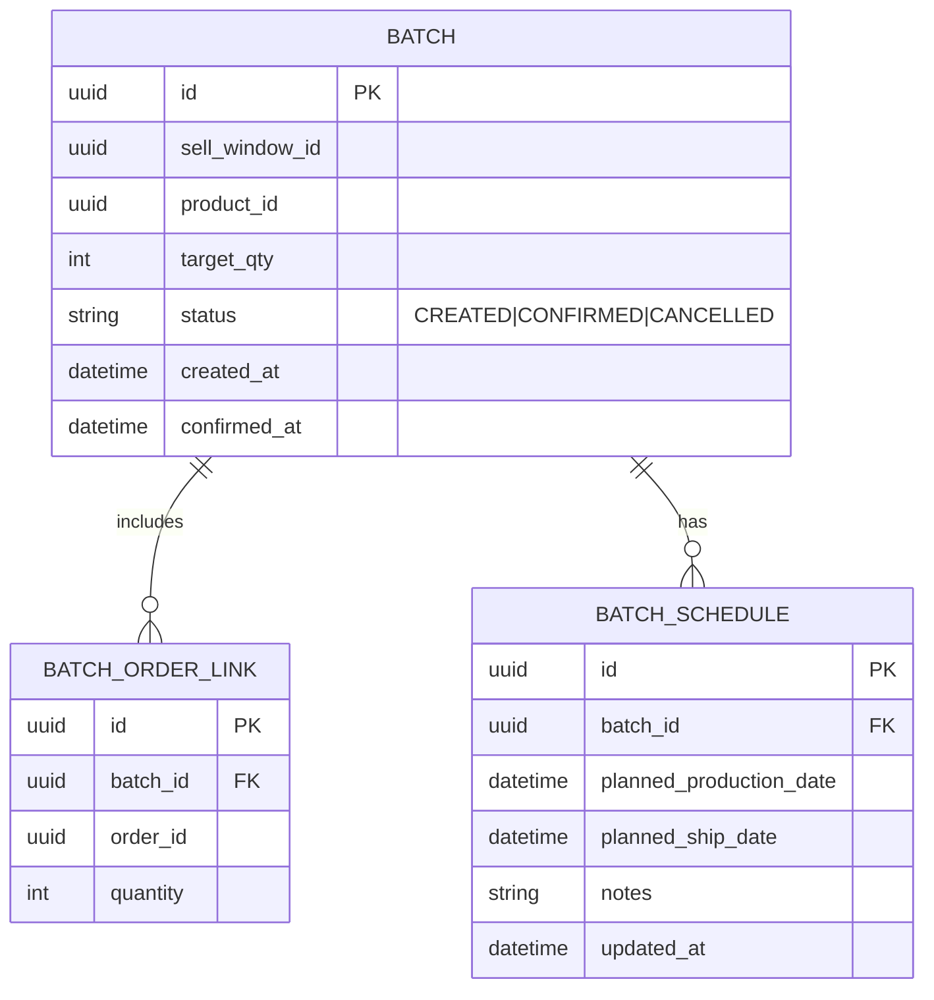
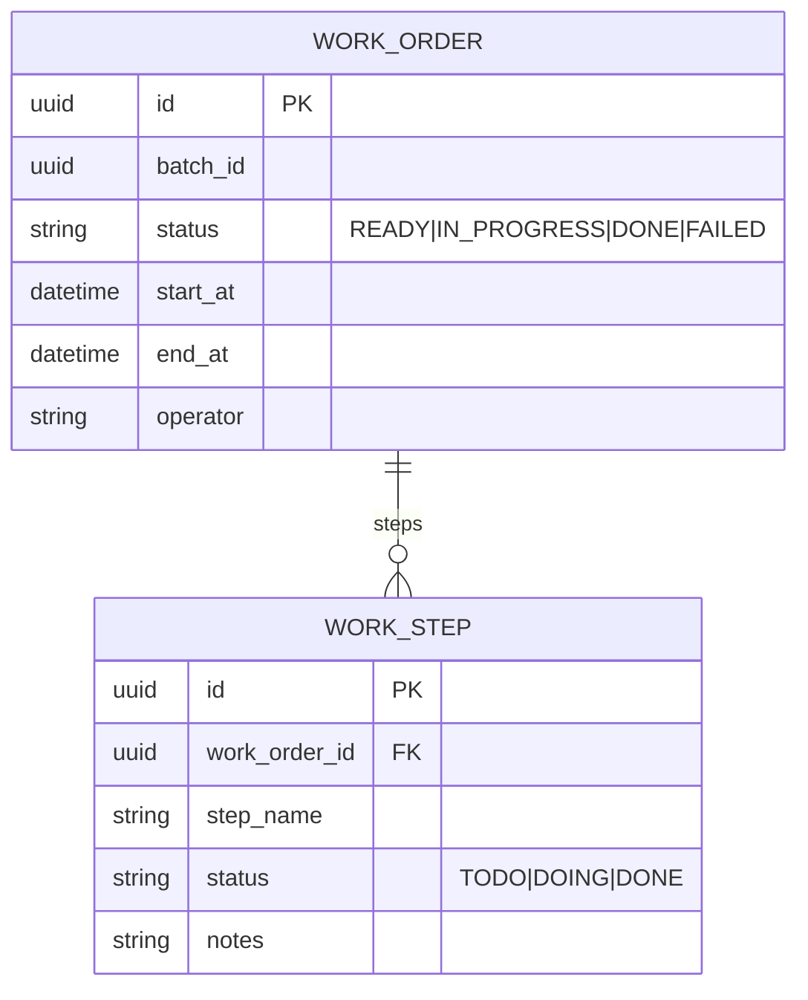
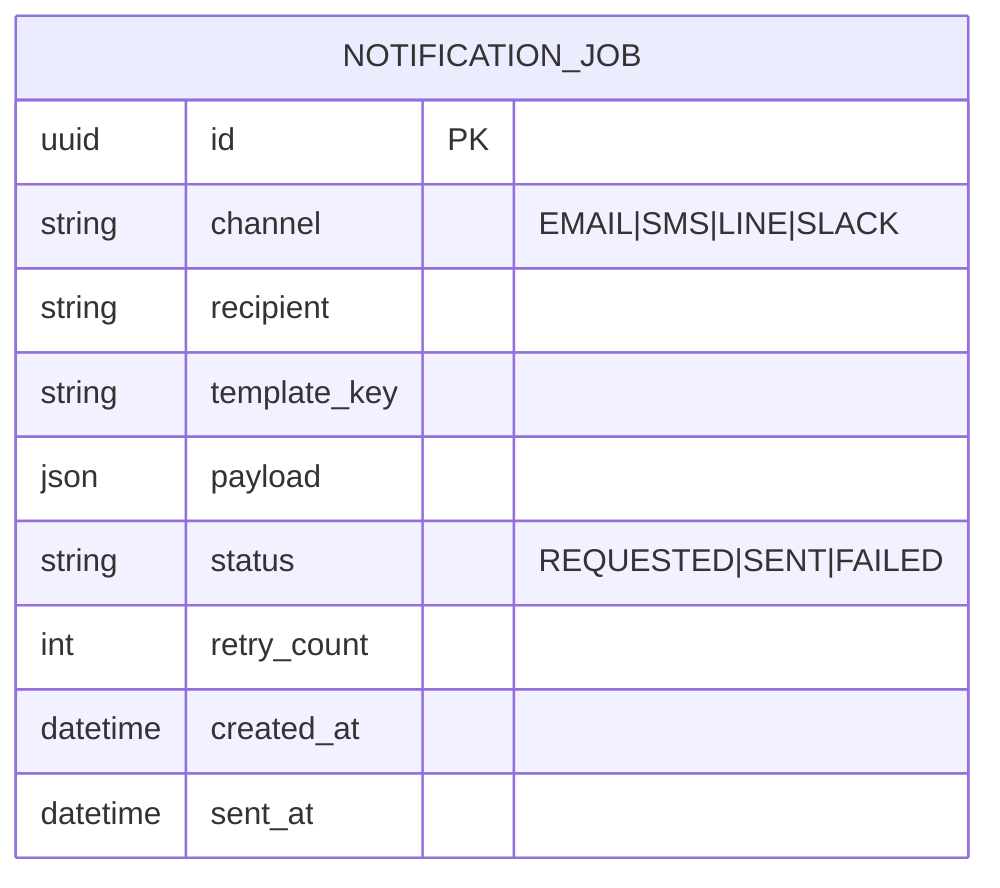

## Catalog Service（商品/檔期/門檻規則）

## Order Service（訂單/明細/Outbox）

## Payment Service（付款單/Outbox）

## Batch Aggregator / Threshold Service（聚合到量）

## Production Planning Service（批次/排程）

## Production Service（工單/狀態）

## Notification Service（通知任務）

