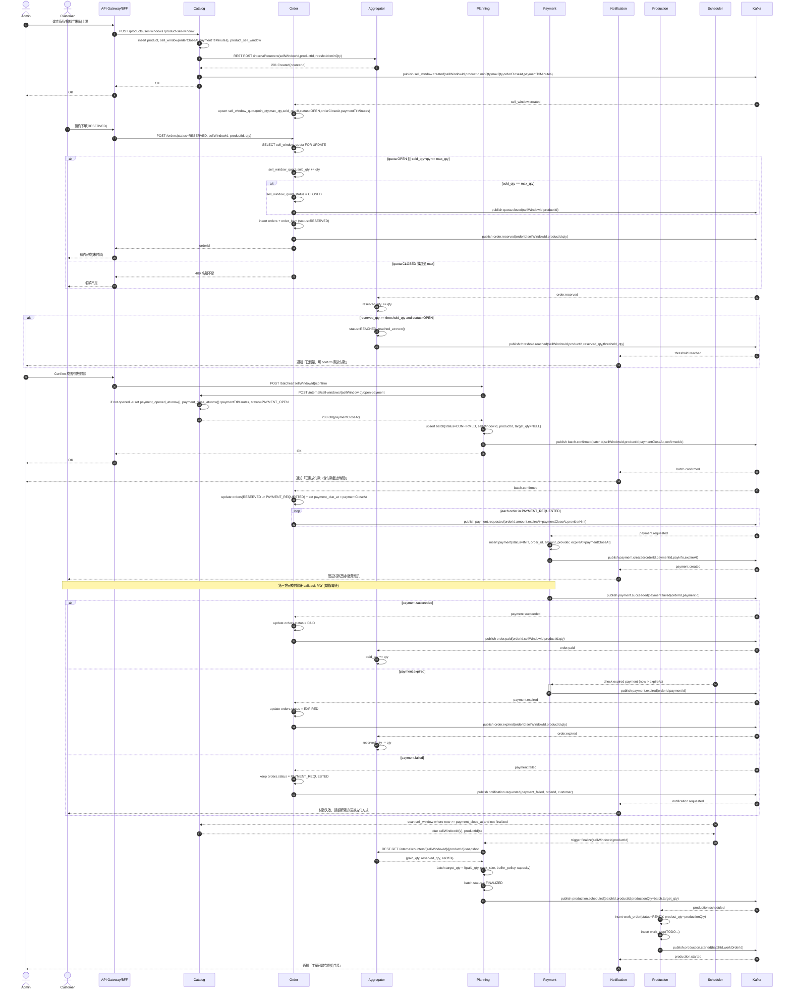
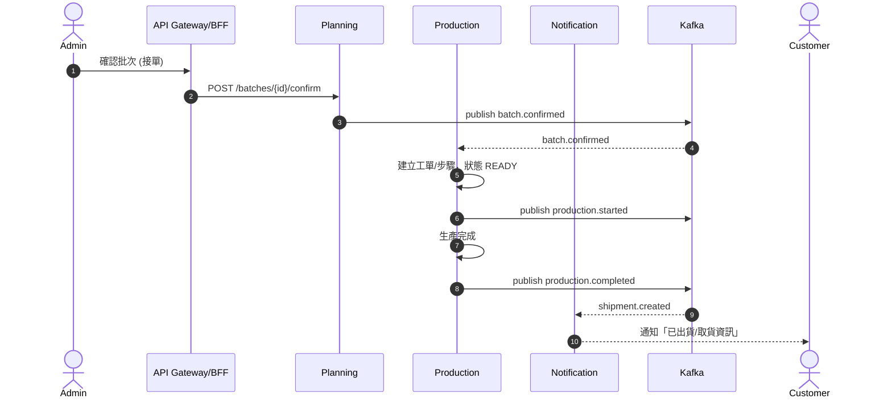

## order_product_to_production

```mermaid
sequenceDiagram
  autonumber
  actor Admin
  actor Customer
  participant GW as API Gateway/BFF
  participant CAT as Catalog
  participant ORD as Order
  participant AGG as Aggregator
  participant PLN as Planning
  participant PAY as Payment
  participant NOTI as Notification
  participant PRD as Production
  participant SCH as Scheduler
  participant K as Kafka

  %% =========================================================
  %% 1) Admin 建立商品/檔期/規則
  %% - Catalog: 建 product/sell_window/product_sell_window
  %% - sell_window 只有接單截止(orderCloseAt) + 付款時窗規則(paymentTtlMinutes)
  %% - 同步 REST 初始化 Aggregator counter
  %% - 發 sell_window.created 事件給 Order 建 sell_window_quota 投影
  %% =========================================================
  Admin->>GW: 建立商品/檔期/門檻與上限
  GW->>CAT: POST /products /sell-windows /product-sell-window
  CAT->>CAT: insert product, sell_window(orderCloseAt,paymentTtlMinutes), product_sell_window
  CAT->>AGG: REST POST /internal/counters(sellWindowId,productId,threshold=minQty)
  AGG-->>CAT: 201 Created(counterId)
  CAT->>K: publish sell_window.created(sellWindowId,productId,minQty,maxQty,orderCloseAt,paymentTtlMinutes)
  CAT-->>GW: OK
  GW-->>Admin: OK

  %% Order 建立 quota(投影/下單檢查用)
  K-->>ORD: sell_window.created
  ORD->>ORD: upsert sell_window_quota(min_qty,max_qty,sold_qty=0,status=OPEN,orderCloseAt,paymentTtlMinutes)

  %% =========================================================
  %% 2) Customer 預約下單（不付款）
  %% - Order 以 sell_window_quota 做名額鎖定（reserved 口徑）
  %% - 成功後發 order.reserved
  %% =========================================================
  Customer->>GW: 預約下單(RESERVED)
  GW->>ORD: POST /orders(status=RESERVED, sellWindowId, productId, qty)
  ORD->>ORD: SELECT sell_window_quota FOR UPDATE
  alt quota OPEN 且 sold_qty+qty <= max_qty
    ORD->>ORD: sell_window_quota.sold_qty += qty
    alt sold_qty == max_qty
      ORD->>ORD: sell_window_quota.status = CLOSED
      ORD->>K: publish quota.closed(sellWindowId,productId)
    end
    ORD->>ORD: insert orders + order_item (status=RESERVED)
    ORD->>K: publish order.reserved(orderId,sellWindowId,productId,qty)
    ORD-->>GW: orderId
    GW-->>Customer: 預約完成(未付款)
  else quota CLOSED 或超過 max
    ORD-->>GW: 409 名額不足
    GW-->>Customer: 名額不足
  end

  %% =========================================================
  %% 3) Aggregator 聚合 reserved_qty / 到量通知
  %% - 只發「狀態變化」事件：threshold.reached
  %% =========================================================
  K-->>AGG: order.reserved
  AGG->>AGG: reserved_qty += qty
  alt reserved_qty >= threshold_qty and status=OPEN
    AGG->>AGG: status=REACHED, reached_at=now()
    AGG->>K: publish threshold.reached(sellWindowId,productId,reserved_qty,threshold_qty)
    K-->>NOTI: threshold.reached
    NOTI-->>Admin: 通知「已到量，可 confirm 開放付款」
  end

  %% =========================================================
  %% 4) Admin Confirm 成團（開放付款）
  %% - 本設計選擇：保留 batch.confirmed 為唯一驅動事件
  %% - Planning confirm 內部先 call Catalog open-payment 取得 paymentCloseAt
  %% - Planning upsert batch(status=CONFIRMED) 後 publish batch.confirmed(含 paymentCloseAt)
  %% =========================================================
  Admin->>GW: Confirm 成團/開放付款
  GW->>PLN: POST /batches/{sellWindowId}/confirm

  PLN->>CAT: POST /internal/sell-windows/{sellWindowId}/open-payment
  CAT->>CAT: if not opened -> set payment_opened_at=now(), payment_close_at=now()+paymentTtlMinutes, status=PAYMENT_OPEN
  CAT-->>PLN: 200 OK(paymentCloseAt)

  PLN->>PLN: upsert batch(status=CONFIRMED, sellWindowId, productId, target_qty=NULL)
  PLN->>K: publish batch.confirmed(batchId,sellWindowId,productId,paymentCloseAt,confirmedAt)
  PLN-->>GW: OK
  GW-->>Admin: OK

  %% (optional) 通知 Admin：已開放付款
  K-->>NOTI: batch.confirmed
  NOTI-->>Admin: 通知「已開放付款（含付款截止時間）」


  %% =========================================================
  %% 5) Order 收到 batch.confirmed 才「要求建立付款單」
  %% - 將 RESERVED -> PAYMENT_REQUESTED
  %% - payment_due_at = paymentCloseAt
  %% - 逐筆 publish payment.requested
  %% =========================================================
  K-->>ORD: batch.confirmed
  ORD->>ORD: update orders(RESERVED -> PAYMENT_REQUESTED) + set payment_due_at = paymentCloseAt
  loop each order in PAYMENT_REQUESTED
    ORD->>K: publish payment.requested(orderId,amount,expireAt=paymentCloseAt,providerHint)
  end

  %% =========================================================
  %% 6) Payment 建立付款單 + 通知付款
  %% =========================================================
  K-->>PAY: payment.requested
  PAY->>PAY: insert payment(status=INIT, order_id, amount, provider, expireAt=paymentCloseAt)
  PAY->>K: publish payment.created(orderId,paymentId,payInfo,expireAt)
  K-->>NOTI: payment.created
  NOTI-->>Customer: 發送付款連結/繳費資訊

  Note over Customer,PAY: 第三方完成付款後 callback PAY (驗簽/冪等)
  PAY->>K: publish payment.succeeded|payment.failed(orderId,paymentId)

  %% =========================================================
  %% 7) Order 依付款結果更新狀態並發布業務事件
  %% - order.paid / order.expired
  %% - payment.failed：不釋放名額、保持可重試（可選通知）
  %% =========================================================
  alt payment.succeeded
    K-->>ORD: payment.succeeded
    ORD->>ORD: update orders.status = PAID
    ORD->>K: publish order.paid(orderId,sellWindowId,productId,qty)

    %% AGG 聚合 paid
    K-->>AGG: order.paid
    AGG->>AGG: paid_qty += qty

  else payment.expired
    SCH-->>+PAY: check expired payment (now > expireAt)
    PAY->>-K: publish payment.expired(orderId,paymentId)
    K-->>ORD: payment.expired
    ORD->>ORD: update orders.status = EXPIRED
    ORD->>K: publish order.expired(orderId,sellWindowId,productId,qty)

    %% AGG 扣回 reserved
    K-->>AGG: order.expired
    AGG->>AGG: reserved_qty -= qty

  else payment.failed
    K-->>ORD: payment.failed
    ORD->>ORD: keep orders.status = PAYMENT_REQUESTED
    ORD->>K: publish notification.requested(payment_failed, orderId, customer)
    K-->>NOTI: notification.requested
    NOTI-->>Customer: 付款失敗，請重新嘗試/更換支付方式
  end

  %% =========================================================
  %% 10) paymentCloseAt 結算最終生產量（以 paid_qty 為準）
  %% - Scheduler 掃 Catalog 的 payment_close_at（時間真相來源仍在 Catalog）
  %% - 觸發 Planning finalize；Planning 向 AGG 取 paid snapshot
  %% - Planning 更新 batch.target_qty 並發 production.scheduled
  %% =========================================================
  SCH-->>CAT: scan sell_window where now >= payment_close_at and not finalized
  CAT-->>SCH: due sellWindowId(s), productId(s)
  SCH-->>PLN: trigger finalize(sellWindowId,productId)

  PLN->>AGG: REST GET /internal/counters/{sellWindowId}/{productId}/snapshot
  AGG-->>PLN: {paid_qty, reserved_qty, asOfTs}

  PLN->>PLN: batch.target_qty = f(paid_qty, pack_size, buffer_policy, capacity)
  PLN->>PLN: batch.status = FINALIZED
  PLN->>K: publish production.scheduled(batchId,productId,productionQty=batch.target_qty)

  %% =========================================================
  %% 11) Production 建工單/工序
  %% =========================================================
  K-->>PRD: production.scheduled
  PRD->>PRD: insert work_order(status=READY, product_qty=productionQty)
  PRD->>PRD: insert work_step(TODO...)
  PRD->>K: publish production.started(batchId,workOrderId)

  K-->>NOTI: production.started
  NOTI-->>Admin: 通知「工單已建立/開始生產」

```

## order_product_to_shipping

```mermaid
sequenceDiagram
  autonumber
  actor Admin
  participant GW as API Gateway/BFF
  participant PLN as Planning
  participant PRD as Production
%%   participant SHP as Shipping
  participant NOTI as Notification
  participant K as Kafka
  actor Customer

  Admin->>GW: 確認批次 (接單)
  GW->>PLN: POST /batches/{id}/confirm
  PLN->>K: publish batch.confirmed

  K-->>PRD: batch.confirmed
  PRD->>PRD: 建立工單/步驟，狀態 READY
  PRD->>K: publish production.started

  PRD->>PRD: 生產完成
  PRD->>K: publish production.completed

%%   K-->>SHP: production.completed
%%   SHP->>SHP: 建立出貨單/物流單
%%   SHP->>K: publish shipment.created

  K-->>NOTI: shipment.created
  NOTI-->>Customer: 通知「已出貨/取貨資訊」


```