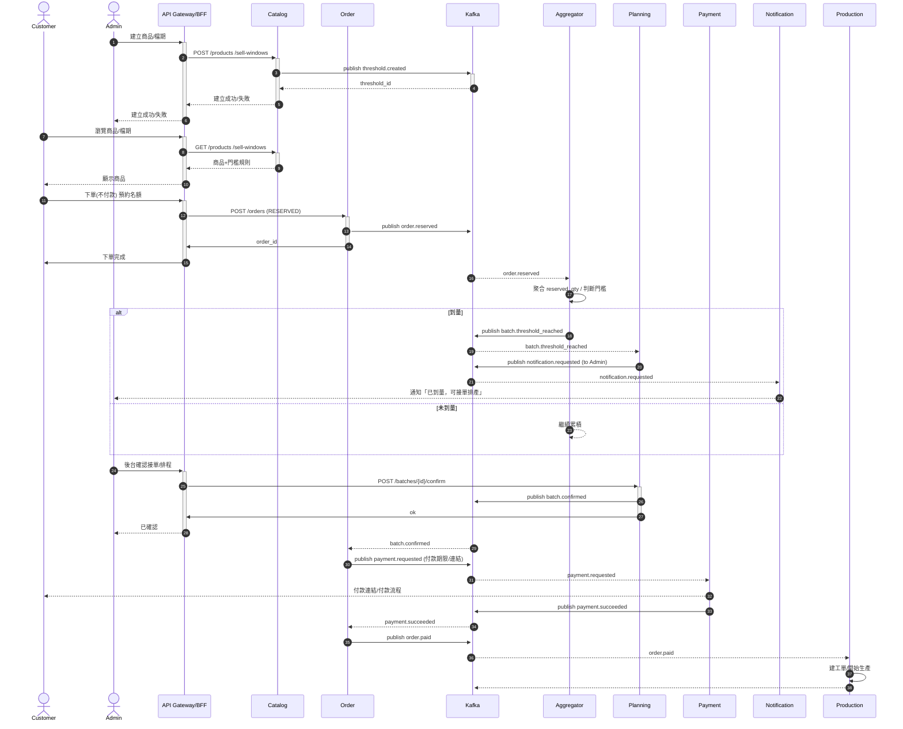
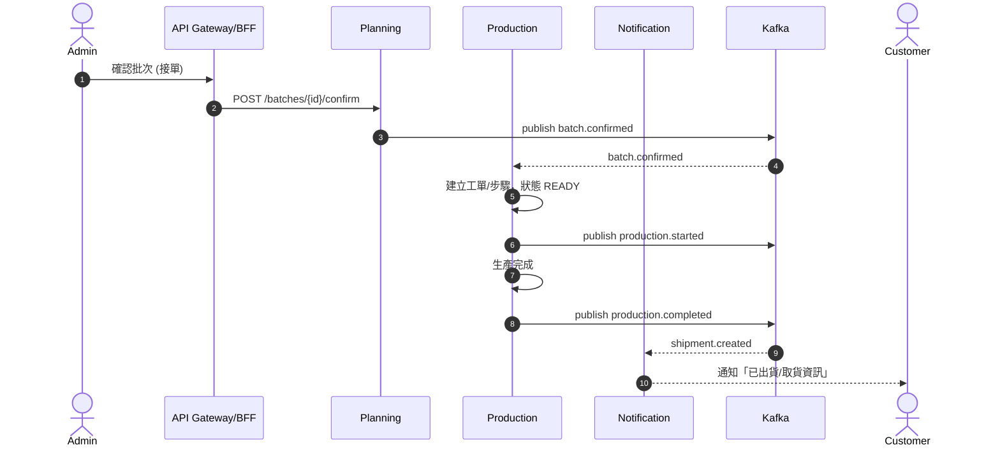

## order_product_to_production

```mermaid
sequenceDiagram
  autonumber
  actor Customer
  actor Admin
  participant GW as API Gateway/BFF
  participant CAT as Catalog
  participant ORD as Order
  participant K as Kafka
  participant AGG as Aggregator
  participant PLN as Planning
  participant PAY as Payment
  participant NOTI as Notification
  participant PRD as Production

  Admin->>+GW: 建立商品/檔期
  GW->>+CAT: POST /products /sell-windows
  CAT->>+K: publish threshold.created
  K-->>-CAT: threshold_id
  CAT-->>-GW: 建立成功/失敗
  GW-->>-Admin: 建立成功/失敗

  Customer->>+GW: 瀏覽商品/檔期
  GW->>+CAT: GET /products /sell-windows
  CAT-->>-GW: 商品+門檻規則
  GW-->>-Customer: 顯示商品

  Customer->>+GW: 下單(不付款) 預約名額
  GW->>+ORD: POST /orders (RESERVED)
  ORD->>+K: publish order.reserved
  ORD->>-GW: order_id
  GW->>-Customer: 下單完成

  K-->>AGG: order.reserved
  AGG->>AGG: 聚合 reserved_qty / 判斷門檻
  alt 到量
    AGG->>K: publish batch.threshold_reached
    K-->>PLN: batch.threshold_reached
    PLN->>K: publish notification.requested (to Admin)
    K-->>NOTI: notification.requested
    NOTI-->>Admin: 通知「已到量，可接單排產」
  else 未到量
    AGG-->>AGG: 繼續累積
  end

  Admin->>+GW: 後台確認接單/排程
  GW->>+PLN: POST /batches/{id}/confirm
  PLN->>K: publish batch.confirmed
  PLN->>-GW: ok
  GW-->>-Admin: 已確認

  K-->>ORD: batch.confirmed
  ORD->>K: publish payment.requested (付款期限/連結)

  K-->>PAY: payment.requested
  PAY-->>Customer: 付款連結/付款流程
  PAY->>K: publish payment.succeeded

  K-->>ORD: payment.succeeded
  ORD->>K: publish order.paid

  K-->>PRD: order.paid
  PRD->>PRD: 建工單/開始生產
  PRD-->>K:

```

## order_product_to_shipping

```mermaid
sequenceDiagram
  autonumber
  actor Admin
  participant GW as API Gateway/BFF
  participant PLN as Planning
  participant PRD as Production
%%   participant SHP as Shipping
  participant NOTI as Notification
  participant K as Kafka
  actor Customer

  Admin->>GW: 確認批次 (接單)
  GW->>PLN: POST /batches/{id}/confirm
  PLN->>K: publish batch.confirmed

  K-->>PRD: batch.confirmed
  PRD->>PRD: 建立工單/步驟，狀態 READY
  PRD->>K: publish production.started

  PRD->>PRD: 生產完成
  PRD->>K: publish production.completed

%%   K-->>SHP: production.completed
%%   SHP->>SHP: 建立出貨單/物流單
%%   SHP->>K: publish shipment.created

  K-->>NOTI: shipment.created
  NOTI-->>Customer: 通知「已出貨/取貨資訊」


```