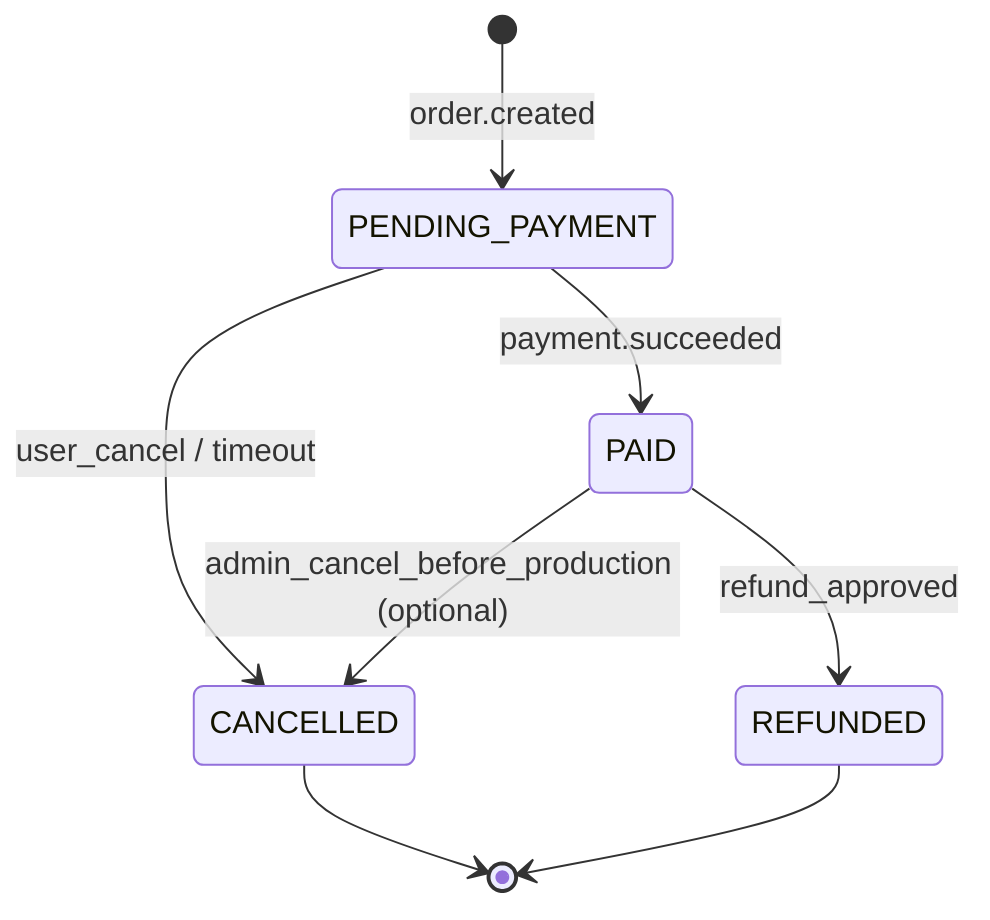
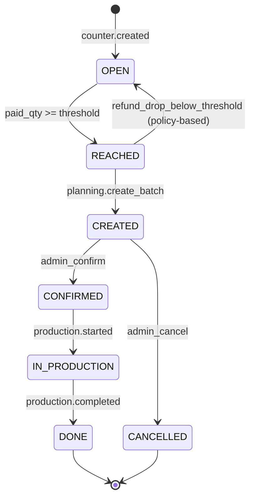

## Order 狀態機

```mermaid
stateDiagram-v2
  [*] --> PENDING_PAYMENT : order.created
  PENDING_PAYMENT --> PAID : payment.succeeded
  PENDING_PAYMENT --> CANCELLED : user_cancel / timeout

  PAID --> REFUNDED : refund_approved
  PAID --> CANCELLED : admin_cancel_before_production (optional)

  CANCELLED --> [*]
  REFUNDED --> [*]
```

## Batch（生產批次）狀態機

```mermaid
stateDiagram-v2
[*] --> OPEN : counter.created
OPEN --> REACHED : paid_qty >= threshold
REACHED --> CREATED : planning.create_batch
CREATED --> CONFIRMED : admin_confirm
CONFIRMED --> IN_PRODUCTION : production.started
IN_PRODUCTION --> DONE : production.completed

CREATED --> CANCELLED : admin_cancel
REACHED --> OPEN : refund_drop_below_threshold (policy-based)
DONE --> [*]
CANCELLED --> [*]
```